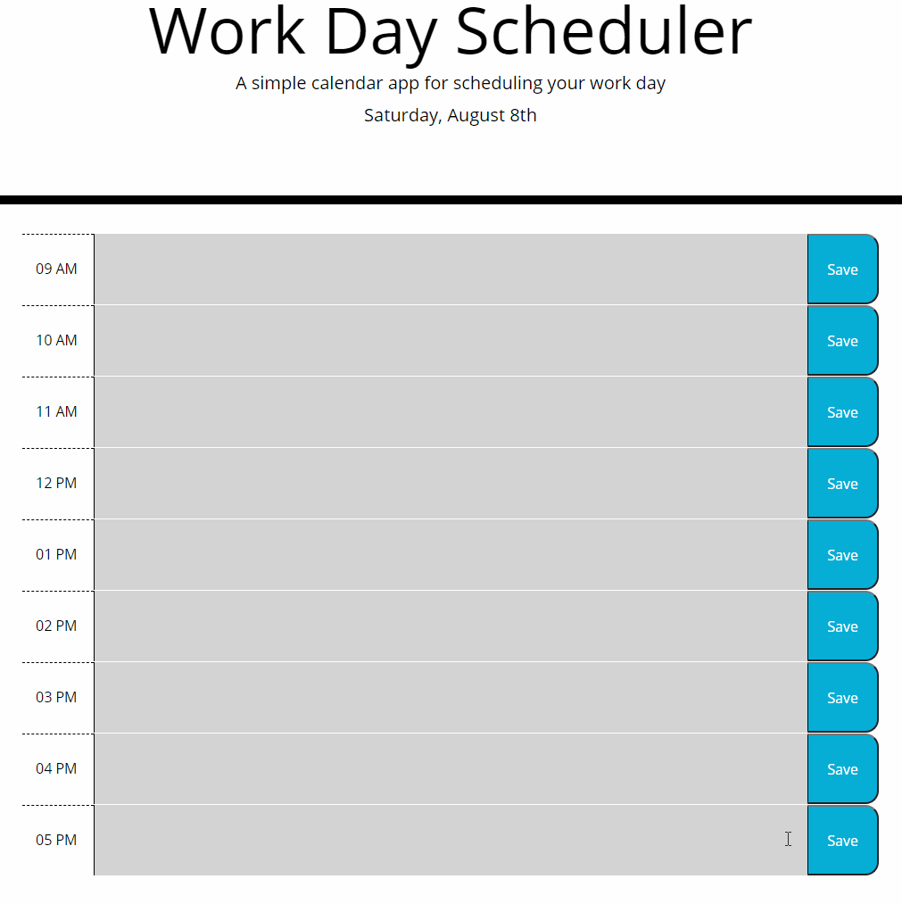

# Work Day Scheduler

This project was a way to practice using jQuery to manipulate DOM objects. The purpose was to dynamically update a webpage and store a user’s data in local storage for them to reference later. I also used Moment JS to track and style the DOM based on the current time.

## Objective:

- Create a Schedule For Users to Plan their Work Day Hour by Hour
- Allow users to type in a field and save their text to reference later
- Style the DOM based on the current time so that a user can visually see the current time and how much is left in the day
- Clear the user’s text at the end of the day so they may start fresh the next

[Work Day Scheduler](https://diegopie.github.io/java-script-timed-quiz/) is hosted on GitHub pages. 

## Outcome: 

I think I finally understand how to effectively use loops and utilizing local storage. This was a concept I had a hard time with, but I was able to use loops along with event listeners to dynamically update the DOM and create local storage keys. This was an intimidating project but once I found the groove of it I really got a sense of how far I’ve come. 

## Collaborators:

A very special thank you to the Bootstrap and the Moment Js teams for making our lives manageable. 

Here are some key web pages that helped build this project:
(https://devhints.io/moment)
(https://scrimba.com/casts/cwpDGhG)
(https://stackoverflow.com/questions/15148659/how-can-i-use-queryselector-on-to-pick-an-input-element-by-name)

This application was authored by [Diego Hernandez](https://github.com/Diegopie)